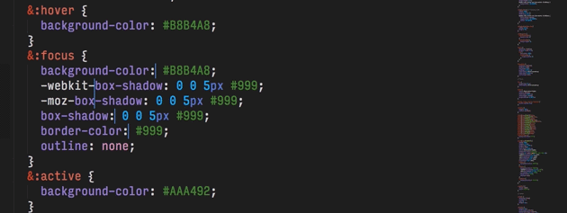

# Switch CSS Color Model



A plugin for Sublime Text. Rapidly and correctly switch between CSS color models (hex, rgb(), rgb() with percentage values, and hsl()).

## Usage

Switch CSS Color Model replaces selected text with the next in a rolling series of color models. By default, it will switch everything on the line containing the cursor, or if multiple lines are selected, will switch everything on those lines. However, if only one part of a line is selected, only that part will be switched.

### Via the Context Menu

Right-click on the selection you want to switch and choose "Switch CSS Color Model."

### With a Keyboard Shortcut

You can set up a keyboard shortcut to run the command by going to **Preferences > Key Bindings - User** and adding your shortcut with the `switch_color_model` command. Here's my configuration, but check your own User and Default key bindings to make sure that you're not overwriting a previously set shortcut.

**Mac**

```
[
{ "keys" : ["ctrl+shift+c"], "command": "switch_css_color_model" }
]
```

**Windows/Linux**

```
[
{ "keys" : ["ctrl+alt+shift+c"], "command": "switch_css_color_model" }
]
```

### Via the Command Palette

Within the command palette, "Switch CSS Color Model."

## Settings

The default settings are

```JavaScript
{
  // Output hex values in upper- or lowercase, e.g. #4A8C27 vs. #4a8c27
  // set to false for uppercase
  "lowercase_hex" : false,
  // Switch to/from alpha models to non-alpha models if alpha value is 1, e.g.
  // rgb(0,0,0) ⟶ rgba(0,0,0,1) ⟶ hsl(0,0%,0%) ⟶ hsla(0,0%,0%,1)
  "use_alpha" : false,
  // Recognize HSL and HSLA models, e.g. hsla(98,76%,54%,0.32)
  "recognize_hsl" : true,
  // Recognize RGB percent notation, e.g. rgb(12%,34%,56%)
  "recognize_rgb_percent" : false
}
```

To change these, navigate to **Preferences > Package Settings > SwitchCSSColorModel > Settings - User** and add your preferences to the opened file, e.g.:

```JavaScript
{
  "recognize_rgb_percent": true
}
```

## Installation

Download the latest source from [https://github.com/Aarononomous/Switch-CSS-Color-Model/archive/master.zip](GitHub), unzip it, and rename it to "Switch CSS Color Model". Then place it in your Packages directory.

The Packages directory is located at:

**OS X**: `~/Library/Application Support/Sublime Text 3/Packages`
**Linux**: `~/.config/sublime-text-3/Packages/`
**Windows**: `%APPDATA%/Sublime Text 3/Packages/`

## Bugs, Issues, and Requests

Please let me know! Email [mailto](hi@aaron-jacobson.com) or submit an issue via [https://github.com/Aarononomous/Switch-CSS-Color-Model/issues](GitHub).

## Pull Requests

You can send a pull request through [https://github.com/Aarononomous/Switch-CSS-Color-Model/pulls](Github); I'll respond as quickly as possible.

## License

MIT &copy; Aaron Jacobson